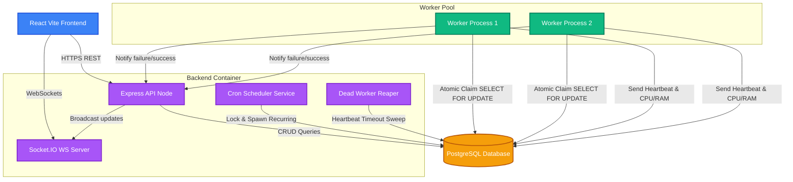

# Component Architecture - Distributed Job Scheduler

This document describes the runtime components of the job scheduling platform and how they interact.

---

## 1. System Components

---

## 2. Component Roles & Communication Flows

### A. React Frontend Dashboard
- **Role**: Operator interface.
- **REST Fetching**: Uses React Query to pull system statuses, queue directories, worker nodes, and execution histories from the Express API.
- **Real-Time Push**: Establishes a Socket.IO WebSocket link with the backend. It receives instantaneous state changes (`job:created`, `job:updated`, `worker:updated`) and invalidates local cache keys, updating the UI instantly without manual polling.

### B. Express Backend Service
- **API Server**: Serves standard REST operations for managing queues, submitting jobs, and viewing telemetry.
- **Cron Scheduler**: An internal background loop running on the API server. It polls the `ScheduledJob` table, locks templates due for execution using Postgres row locks to prevent duplicate spawns, and schedules actual queue instances.
- **Dead Worker Reaper**: A cron sweep that detects workers who have missed heartbeats for over 15 seconds. It transitions them to `DEAD` and reschedules their unfinished jobs.
- **Socket.IO Server**: Manages WebSocket connections and broadcasts system updates.

### C. PostgreSQL Database
- **Role**: Persistent transactional storage.
- **Claim Isolation**: Enforces exclusive claiming using row-level locking (`SELECT FOR UPDATE SKIP LOCKED`).
- **Telemetry Storage**: Stores structured execution logs (`JobLog`) and attempts (`JobExecution`) for later audit.

### D. Horizontally Scalable Workers
- **Role**: Job execution engine.
- **Independent Loops**: Standalone processes that poll the DB. They do not communicate with each other, enabling horizontal scaling.
- **Heartbeat Daemon**: Sends a heartbeat transaction every 5 seconds to announce availability and push system load metrics.
- **Work execution**: Invokes executors for HTTP requests, calculations, or flaky jobs, handling errors and updating state.
